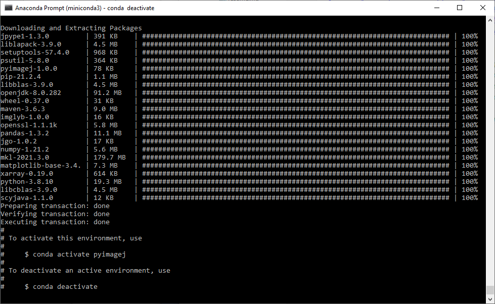
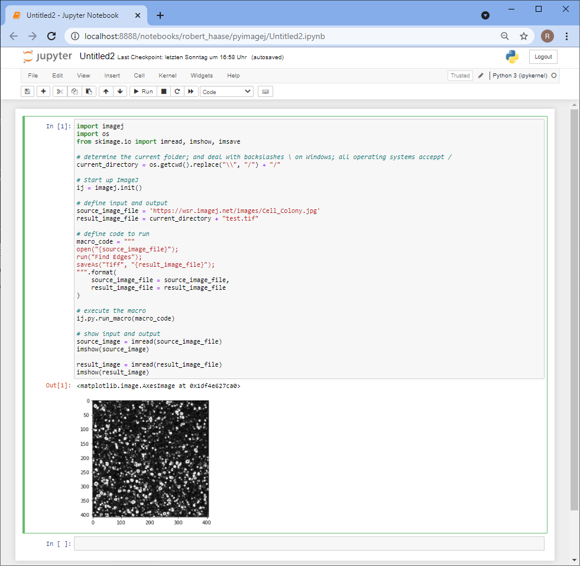

## Running ImageJ macros from python: pyimagej

There is a huge community of image data scientists used to ImageJ macro and also a large community who use python libraries such as 
[scikit-image](https://scikit-image.org/) and 
[scipy](https://scipy.org/) to process and analyse their image data.
Obviously, both communities enjoy certain advantages of their ecosystem.
Goal of the [pyimagej](https://github.com/imagej/pyimagej/) project is to build bridges between these two ecosystems 
and in particular enable the python community to run ImageJ plugins within their python workflows.
Before we can get started, we should 
[download and install conda](https://github.com/BiAPoL/Bio-image_Analysis_with_Python/blob/main/conda_basics/01_conda_environments.md).
Then, we can setup a conda environment specifically for pyimagej as explained in 
[pyimagej's installation instructions](https://github.com/imagej/pyimagej/blob/master/doc/Install.md):

```
conda config --add channels conda-forge
conda config --set channel_priority strict
```

```
conda create -n pyimagej pyimagej openjdk=8
```

Just to explain this command a bit. It mentions "pyimagej" twice, intentionally. 
The first one comes with a decorator: ```-n pyimagej```. The `-n` is a short version of `--name` and declares that the conda environment we create will be called "pyimagej".
The second "pyimagej" specifies a [conda package named pyimagej](https://anaconda.org/conda-forge/pyimagej). Thus, we are installing `pyimagej` into a conda environment named "pyimagej". 
Furthermore, we also install a [Java Development Kit (JDK)](https://openjdk.java.net/), version 8, into this conda environment as specified with `openjdk=8`.

This will install some packages:



We then just do what the terminal suggests us to do, we activate the environment, again named "pyimagej":
```python
conda activate pyimagej
```

In order to test pyimagej, we also need to install some more stuff such as [jupyter](https://jupyter.org) notebooks and [scikit-image](https://scikit-image.org/) for loading and visualizing images:

```
conda install jupyter notebook scikit-image
```

We can then test the installation, e.g. by executing the following code in a juypter notebook. Therefore, we start jupyter by entering this on the command line:
```python
jupyter notebook pyimagej_first_test.ipynb
```

Afterwards, we paste this code in the notebook and enter `SHIFT-Enter`
```python
import imagej
import os
from skimage.io import imread, imshow, imsave

# determine the current folder; and deal with backslashes \ on Windows; all operating systems acceppt /
current_directory = os.getcwd().replace("\\", "/") + "/"

# Start up ImageJ
ij = imagej.init()

# define input and output
source_image_file = 'https://wsr.imagej.net/images/Cell_Colony.jpg'
result_image_file = current_directory + "test.tif"

# define code to run
macro_code = """
open("{source_image_file}");
run("Find Edges");
saveAs("Tiff", "{result_image_file}");
""".format(
    source_image_file = source_image_file, 
    result_image_file = result_image_file
)

# execute the macro
ij.py.run_macro(macro_code)

# show input and output
source_image = imread(source_image_file)
imshow(source_image)

result_image = imread(result_image_file)
imshow(result_image)
```
... that should result in this output:

